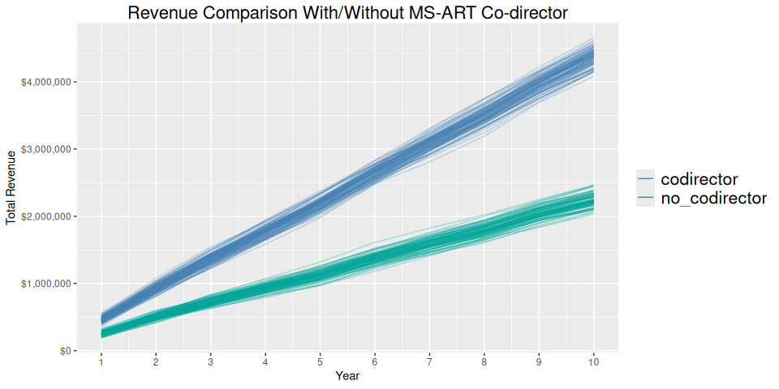
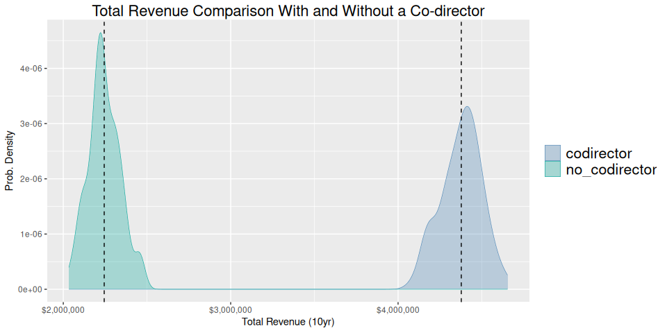

MS-ART Program Projected Financial Simulation
================
Stu Field

# Overview

The goal of this preliminary analysis is to gain an understanding of the
effect that hiring a co-director attached to the MS-ART program would
have on the revenue from the University’s perspective, and to isolate
the likely financial impact to the University such a hire would have
over a 10 year period.

## Simulation Overview

Below is a high-level summary of the parameters in the simulation:

- 10 year simulation length: each simulation begins at year 1 and tracks
  the total (cumulative) revenue generated by tuition fees (Univ
  revenue).
- the starting number of students is either 24 (co-director) or 16 (no
  co-director)
- the stochastic processes are:
  - number of students entering the program
  - number of non-resident students (modeled as ~70%)
  - tuition affected by 1-3% inflation per year (randomly assigned)
  - number of students declining/failing to start the program (this is
    equal among resident and non-resident students), and is randomly
    chosen at 1-3 students per year. The no. students entering the
    program is reduced by this number

## Simulation Code

``` r

#' @param with_codirector `logical(1)`. Include a co-director. This
#'   effects the max number of students in the program, either 24 or 16.
#' @param n_years `integer(1)`. The no. years to project out the simulation.
#' @param oper_budget `numeric(1)`. The operating budget coming from CSU.
#'
#' @examples
#' sim_projection()
#' sim_projection(FALSE)
#'
sim_projection <- function(with_codirector = TRUE, n_years = 10L,
                           oper_budget     = 145600.00) {

  # calc Univ tuition revenue
  calc_revenue <- function(n1, n2, base1 = 14267.18, base2 = 30955.38) {
    inf  <- runif(1, 1.01, 1.03)   # random inflation 1% - 3%
    base <- (n1 * base1 * inf) +  (n2 * base2 * inf)
    base - oper_budget
  }

  n_students <- ifelse(with_codirector, 24L, 16L)
  n_decline  <- withr::with_seed(101, sample(1:3L, n_years, replace = TRUE))
  revenue    <- numeric(n_years)

  for ( i in seq(n_years) ) {
    n_total <- n_students - n_decline[i]
    n_nonres <- rbinom(1L, n_total, prob = 0.7)
    n_res <- n_total - n_nonres
    revenue[i] <- calc_revenue(n_res, n_nonres)
  }

  revenue <- cumsum(revenue)
  df <- setNames(data.frame(as.list(revenue)), seq(n_years))
  names(df) <- seq(n_years)
  cbind(type = ifelse(with_codirector, "codirector", "no_codirector"), df)
}
```

## Run the Simulation (10 yrs)

Now we run 100 simulations of 10 years each, with and without a
co-director and compare the total revenue to the university under each
scenario. Simulations beyond 100 yielded similar conclusions with
respect to total cumulative revenue.

``` r
# no. simulations
n <- 100L

# run the sim
outsim <- lapply(rep(1:0, each = n), sim_projection) |>
  do.call(what = "rbind") |>
  rowid_to_column("simulation")

# wrangle data for plotting
plot_df <- outsim |>
  pivot_longer(cols = c(-type, -simulation),
               names_to = "year", values_to = "revenue") |>
  unite("simulation", c(type, simulation), remove = FALSE) |>
  mutate(year = as.numeric(year))

# Plot traces
plot_df |>
  ggplot(aes(x = year, y = revenue, group = simulation, color = type)) +
  geom_line(alpha = 0.3) +
  scale_color_manual(values = c("steelblue", "#00A499")) +
  scale_y_continuous(labels = scales::dollar) +
  scale_x_continuous(n.breaks = max(plot_df$year)) +
  guides(color = guide_legend(override.aes = list(size = 5, alpha = 1))) +
  labs(title = "Revenue Projections With/Without MS-ART Co-director",
       x = "Year", y = "Total Revenue") +
  NULL
```

<!-- -->

## Impact on Total Revenue

The simulations above show a significant increase in total revenue
across all years under the co-director scenario. But by how much? Below
we look at the revenue at year 10 for each simulation and average across
simulations to get an idea of the average 10 year difference in revenue
generation of the co-director scenario.

``` r
split_revenue <- tapply(outsim, outsim$type, `[`, x = ncol(outsim))
means <- vapply(split_revenue, mean, numeric(1))
means
#>    codirector no_codirector 
#>       4377617       2244464
```

## PDFs Across Simulations

Visualizing the distribution of simulation outcomes at 10 years shows a
distinct increase in total revenue of about \$2,133,153.63 under to the
co-director scenario.

``` r
data.frame(split_revenue) |>
  gather(key = "type") |>
  ggplot(aes(x = value, color = type)) +
  geom_density(aes(fill = type), alpha = 0.3, linewidth = 0.2) +
  labs(title = "PDFs of Total Revenue With/Without a Co-director",
       y = "Prob. Density", x = "Total Revenue (10yr)") +
  scale_fill_manual(values = c("steelblue", "#00A499")) +
  scale_color_manual(values = c("steelblue", "#00A499")) +
  scale_x_continuous(labels = scales::dollar) +
  geom_vline(xintercept = means, linetype = "dashed") +
  NULL
```

<!-- -->

------------------------------------------------------------------------

Created in `RStudio` (`v2024.04.2+764`) and R version 4.4.1
(2024-06-14).
